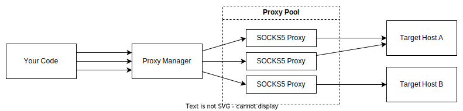

# Forward Proxy Manager

A proxy server that distributes your requests over a pool of proxies. It is made to easily scrape massive ammounts of pages on websites behind rate-limiters and other systems without expensive bot protection. Mainly Cloudflare on normal settings. It makes individual requests over random proxies from the pool, so it is best suited for unauthenticated sessions and public pages.

## Features

- Fetches and validates proxy list from a given URL
- Fakes user agent string and some headers to avoid bot detection
- Interacts via HTTPS PROXY protocol for seamless integration with various HTTP clients.
- Supports HTTPS, HTTP2, persistent connections for high performance
- Keeps track of rate limits on individual proxy-target pairs and backs off on 429 (Too Many Requests) errors
- Retry mechanism for failed requests using alternative proxies
- Forwards most headers from client to target
- Adjustable request priority using `x-priority` header
- Built-in request queue for bulk requests without rate limit concerns
- Optional web dashboard for real-time monitoring of pending requests

## Usage



### 1. Set Up the Proxy Manager

With Docker:

```bash
docker run -it -p 8080:8080 -p 8081:8081 -e PROXY_LIST_URL=https://example.com/proxies ghcr.io/jkelin/forward-proxy-manager:latest
```

Using docker-compose:

```yaml
version: "3.8"
services:
  proxy-manager:
    image: ghcr.io/jkelin/forward-proxy-manager:latest
    ports:
      - 8080:8080
      - 8081:8081
    environment:
      PROXY_LIST_URL: https://example.com/proxies
```

### 2. Integrate with HTTP Client

Proxy Manager is a MITM proxy and uses self-signed certificate. You must configure your HTTP client to ignore certificate errors.

For [Got](https://github.com/sindresorhus/got) in Node.js:

```typescript
import got from "got";
import { HttpsProxyAgent } from "hpagent";

const proxyAgent = new HttpsProxyAgent({
  keepAlive: true,
  proxy: "https://localhost:8080", // https needed to scrape https sites
  rejectUnauthorized: false, // ignore https errors (IMPORTANT)
});

const data = await got({
  method: "GET",
  url: "https://httpbin.org/get", // target url
  headers: {
    "x-priority": "0", // higher priority is going to be processed first
  },
  agent: {
    https: proxyAgent,
  },
}).json();
```

> Note: Since this proxy uses a self-signed certificate, you'll need to configure the HTTP client to ignore certificate validation.

## Options

Set up the Proxy Manager using environment variables. Only PROXY_LIST_URL is mandatory. For detailed definitions, see [main.go](main.go).

| Environment                 | Default      | Description                                                                                        |
| --------------------------- | ------------ | -------------------------------------------------------------------------------------------------- |
| `PROXY_LIST_URL`            | **REQUIRED** | URL from which to download the proxy list. Refer to proxy list format below                        |
| `REQUEST_TIMEOUT`           | `20s`        | Timeout for individual requests to target host                                                     |
| `RETRIES`                   | `1`          | Number of times to retry failed requests to target                                                 |
| `RETRY_TIMEOUT`             | `5s`         | Timeout subsequent requests to target                                                              |
| `INITIAL_IP_INFO_TIMEOUT`   | `10s`        | Timeout for proxy IP info request used to check proxy availability                                 |
| `HOST_INFO_REQUEST_TIMEOUT` | `5s`         | Timeout for host info request which we need to get information about HTTPS/HTTP2/IPV6 availability |
| `THROTTLE_REQUESTS_PER_MIN` | `30`         | Target host max requests per minute                                                                |
| `THROTTLE_REQUESTS_BURST`   | `5`          | Max concurrent target requests for a single proxy                                                  |
| `UNREACHABLE_CLIENT_RETRY`  | `60s`        | Retry for failing proxies                                                                          |
| `ENABLE_WEB`                | `false`      | Enable web UI on `:8081` for monitoring and debugging pending requests                             |

## Proxy list format

`HOST:PORT:USERNAME:PASSWORD`, newline separed.

Proxy list get downloaded from `PROXY_LIST_URL` on Proxy Manager's startup. Proxies must be SOCKS5, not HTTP. This format is what you get from [Webshare](https://www.webshare.io/?referral_code=x71lsv7e6k56) and similar services.

Example:

```
127.0.0.1:1080:username:password
127.0.0.2:1080:username:password
```
